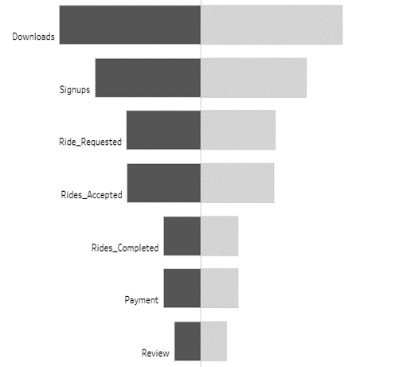

# Metrocar Funnel Analysis
)

## Introduction

Metrocar is a ride-sharing platform that connects riders and drivers through its mobile application. This README provides an overview of the project, its objectives, key metrics, business questions, and the analysis and recommendations derived from the data.

## Objective

- **Optimize funnel performance:** Enhance user satisfaction and strengthen market position through detailed analysis and actionable recommendations for improved user engagement and revenue growth.

## Key Metrics

- Download-to-signup conversion rates
- Ride request acceptance rates
- Completed ride rates
- Payment processing efficiency
- User review submissions

## Business Questions

1. What steps of the funnel should we research and improve? Are there any specific drop-off points preventing users from completing their first ride?
2. Where should we focus our marketing budget among different platforms (iOS, Android, Web) for the upcoming year?
3. What age groups perform best at each stage of our funnel? Which age group(s) likely contain our target customers?
4. If we want to adopt a price-surging strategy, what does the distribution of ride requests look like throughout the day?
5. What part of our funnel has the lowest conversion rate, and how can we improve it?

## Project Workflow

1. **Data Extraction:**
   - Extracted data from the Metrocar database to address the business questions outlined in the Excel file.
   - )

2. **Visualization with Tableau:**
   - Utilized Tableau for data visualization to create insightful charts and graphs.
   - Developed a funnel visualization to analyze user engagement throughout the Metrocar customer journey.
   -    

3. **Report Creation:**
   - Generated a comprehensive report in both document (Docs) and presentation (PPT) formats.
   - Summarized key metrics, findings, and actionable recommendations for improved user engagement and revenue growth.

4. **GitHub Repository Setup:**
   - Established the GitHub repository for the project, including this README file to provide context and guidance for users and contributors.

## Analysis and Recommendations

### Funnel Drop-Offs

- Address the drop in the user funnel between ride acceptance and completion (50% drop).
- Address the drop in the ride funnel between ride request and ride acceptance (35% drop).

### Platform Analysis (User Level)

**Observation:**
- iOS performs the best, contributing 60.5% of users.
- The web channel underperforms, contributing only 10.0%.

**Recommendation:**
- Allocate the budget primarily to iOS.
- Reduce the budget for the web channel.
- Consider reallocating the reduced web channel budget to Android.

### Platform Analysis (Ride Level)

**Observation:**
- iOS is the best-performing platform, contributing 60.9% of rides.
- The web channel underperforms, contributing only 10.0%.

**Recommendation:**
- Reduce the web channel budget.
- Allocate 55% of the marketing budget to iOS, 40% to Android, and 5% to the web.

### Age Group Analysis (User Level)

**Observation:**
- The age group between 35 and 44 exhibits strong performance.
- The 'unknown' category impacts the real age group distribution.

**Recommendation:**
- Implement a mandatory age input requirement for comprehensive data collection.
- Focus marketing efforts on the 25-34 and 35-44 age groups.

### Age Group Analysis (Ride Level)

**Observation:**
- The age group between 35 and 44 demonstrates robust performance, contributing to approximately 114,209 rides.
- 115,729 users in the 'unknown' category impact the real age group distribution, showing the lowest conversion rate despite the highest number of rides.

**Recommendation:**
- Focus marketing efforts on the 25-34 and 35-44 age groups.
- Market research indicates 45% of users aged 18-29 and 36% aged 30-49 use ride-sharing. Implement a multi-user ride-share for users aged 25-44 to reduce cancellations and enhance satisfaction. **This chart excludes ‘Null’ Age group for clarity**

### Time Distribution Analysis

**Observation:**
- Two peak demand periods: 8 am to 10 am (51.0% of rides) and 4 pm to 8 pm (31.2% of rides).
- Surge pricing encourages more drivers during high-demand hours, balancing supply and demand.

**Recommendation:**
- Leverage surge pricing during 4 pm to 8 pm and 8 am to 10 am to boost revenue.
- Ensure an adequate supply of drivers during high-demand hours for seamless service.

### Hourly Analysis

**Observation:**
- Peak demand during 8 am and 9 am (15.6% each of rides).
- Prioritizing driver availability during peak hours is essential for optimal service.

**Recommendation:**
- Implement incentives to attract more drivers during peak hours at 8 am and 9 am.
- Optimize driver deployment strategies to ensure maximum coverage during high-demand periods.
- Reduce wait times for users by enhancing driver availability during these peak hours.

## Final Recommendations

**User Level:**
- Personalize the signup process for enhanced user acquisition.
- Enhance user communication and interface to improve the ride completion rate.
- Implement a mandatory age input requirement during the app download process for comprehensive data collection.

**Ride Level:**
- Streamline the ride acceptance process to minimize drop-off rates.
- Optimize driver availability during peak demand hours.
- Introduce surge pricing during peak demand periods.

**Thank You**

